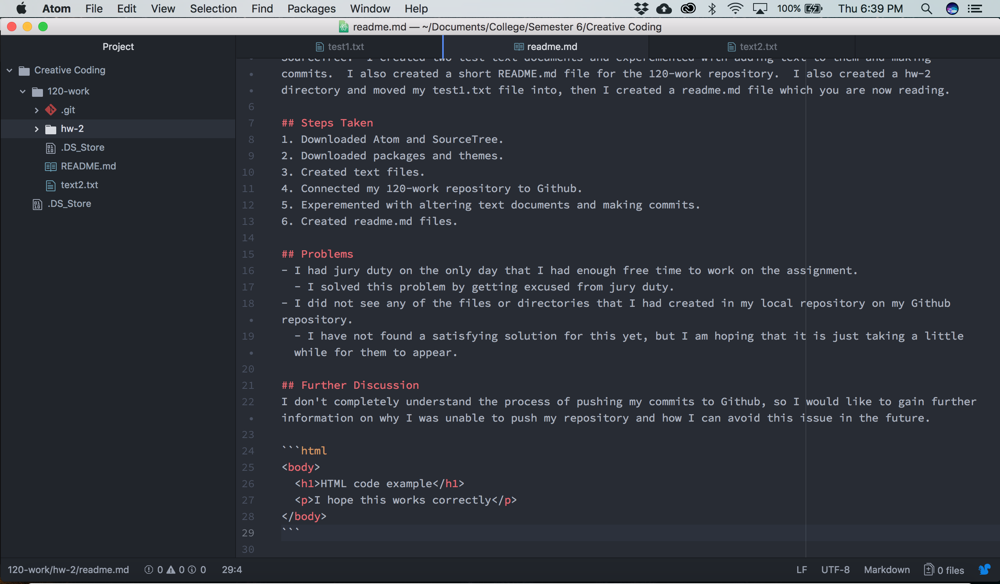

Micah Pengilly

# Week 2 Homework
## Summary
This week I downloaded Atom and SourceTree in order create text files and push them to [Github](https://github.com/).  I then downloaded a few packages for Atom in order to improve its usability for web development.  Next I created a directory called 120-work, which I connected to Github through SourceTree.  I created two test text documents and experemented with adding text to them and making commits.  I also created a short README.md file for the 120-work repository.  I also created a hw-2 directory and moved my test1.txt file into, then I created a readme.md file which you are now reading.

## Steps Taken
1. Downloaded Atom and SourceTree.
2. Downloaded packages and themes.
3. Created text files.
4. Connected my 120-work repository to Github.
5. Experemented with altering text documents and making commits.
6. Created readme.md files.

## Problems
- I had jury duty on the only day that I had enough free time to work on the assignment.
  - I solved this problem by getting excused from jury duty.
- I did not see any of the files or directories that I had created in my local repository on my Github repository.
  - I have not found a satisfying solution for this yet, but I am hoping that it is just taking a little while for them to appear.

## Further Discussion
I don't completely understand the process of pushing my commits to Github, so I would like to gain further information on why I was unable to push my repository and how I can avoid this issue in the future.

```html
<body>
  <h1>HTML code example</h1>
  <p>I hope this works correctly</p>
</body>
```

